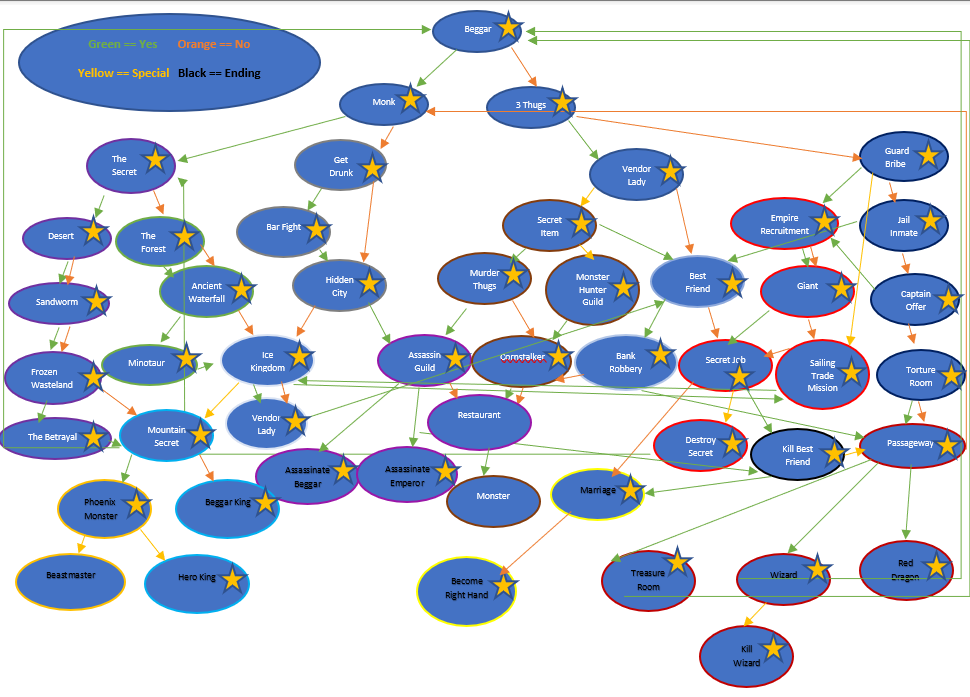

# Choose Your Own Adventure Game

This is my first choose your own adventure game written in python. This fantasy game was created as a learning experience to be played in the terminal. It implements a text based choice game with a monster battle system, purchaseable items, various minigames, and movements inside maps.

# Requirements

- Python 3

# Potential Choices Available

This game is currently unfinished. The choices you see with a gold star are stories that are mostly completed.

