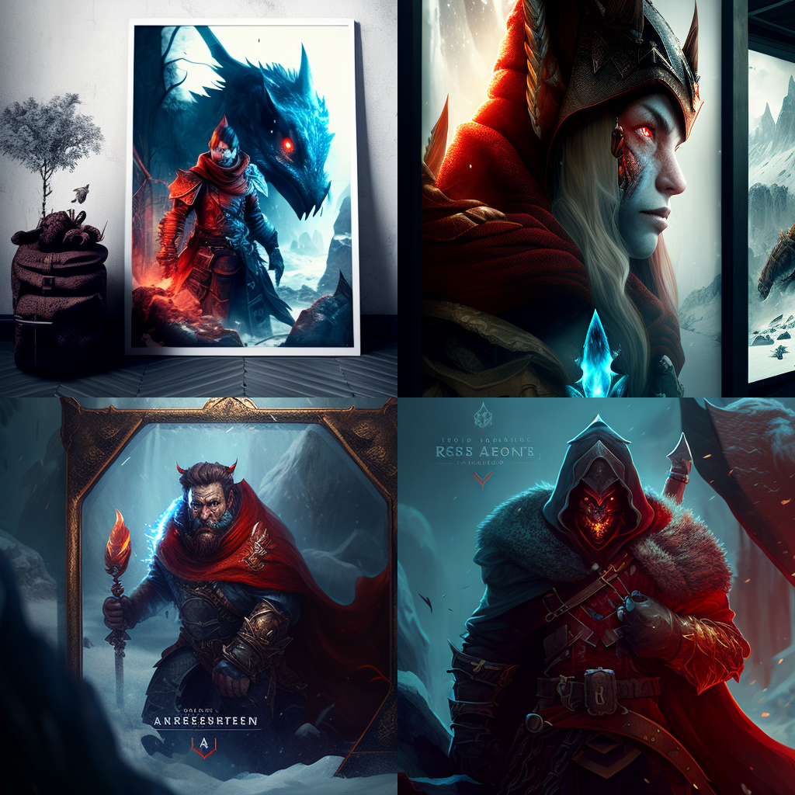

# Choose Your Own Adventure Game

Welcome to the ultimate choose your own adventure game, written in python! This is my first fantasy text game I created which is not just any ordinary game - it's a thrilling and exciting journey through a fantastical world filled with monsters, minigames, and mysteries.

In this game, you'll be able to explore different 2D maps and encounter all sorts of challenges along the way. You'll be able to battle or tame fierce monsters using the unique and intuitive monster battle system, and you'll be able to purchase or find all sorts of rare items to help you on your journey.

But that's not all - this game also features a variety of minigames, including blackjack, hangman, rock-paper-scissors, memory guessing games, riddles, and more. There's so many things to discover and do in this game. Your CHOICES also have CONSEQUENCES and change certain aspects of the game, unlocks new storylines, and new endings.

So what are you waiting for? Start your adventure today!


Midjourney Copyright @ 2022
Licensed under the Creative Commons Attribution-NonCommercial 4.0 International Public License. Please read the disclaimer of warranties on Section 5 – Disclaimer of Warranties and Limitation of Liability.
This picture is licensed under this Public License: [Creative Commons BY-NC 4.0 License](https://creativecommons.org/licenses/by-nc/4.0/legalcode)


# Requirements

- Python 3
- This game is to meant to be played in the terminal
- If you are having trouble with the UTF-8 encoding when starting the game, first go into current working directory where the game is located. 
  Then if you're using the git bash terminal, you can try using the following command:
  ```PYTHONIOENCODING=utf-8 python main.py```

# Potential Choices Available


