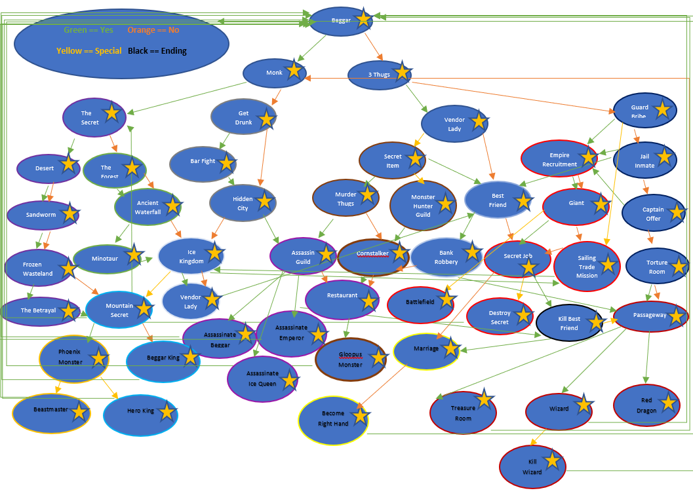

# Choose Your Own Adventure Game

Welcome to the ultimate choose your own adventure game, written in python! This the first fantasy text game I created which is not just any ordinary game - it's a thrilling and exciting journey through a fantastical world filled with monsters, minigames, and mysteries.

In this game, you'll be able to explore different 2D maps and encounter all sorts of challenges along the way. You'll be able to battle fierce monsters using the unique and intuitive monster battle system, and you'll be able to purchase or find all sorts of items to help you on your journey.

But that's not all - this game also features a variety of minigames, including poker, blackjack, hangman, rock-paper-scissors, memory guessing games, riddles, and more. You'll never be bored with so much to do and discover in this game.

So what are you waiting for? Start your adventure today!

# Requirements

- Python 3

# Potential Choices Available

